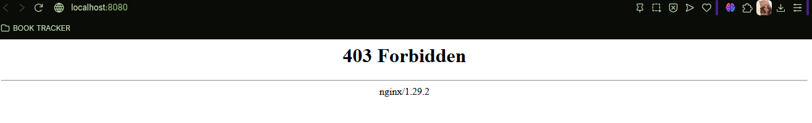
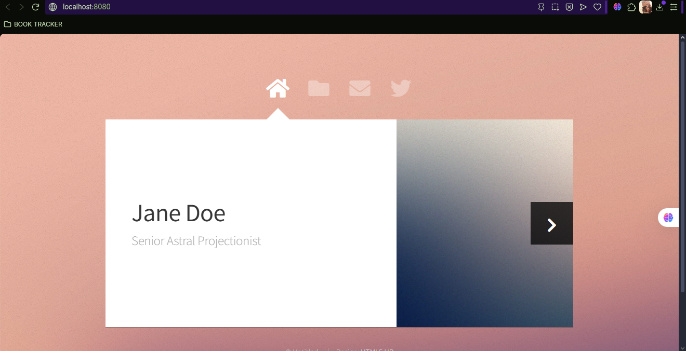

# BIND MOUNT
En un bind mount mapeamos (montar) un directorio o archivo específico del sistema de archivos del host con una parte del sistema de ficheros del contenedor.

```
docker run -d --name <nombre contenedor> -v <ruta carpeta host>:<ruta carpeta contenedor> <imagen> 
```
ó
```
docker run -d --name <nombre contenedor> --mount type=bind,source=<ruta carpeta host>,target=<ruta carpeta contenedor> <imagen>
```
- destination, dst, target: La ruta donde se monta el archivo o directorio en el contenedor.
- source, src: El origen del montaje.
  
### En tu computador crear una carpeta llamada nginx y dentro de esta carpeta crea otra llamada html. Como se aprecia en la figura.


### Crear un contenedor con la imagen nginx:alpine, mapear todos por puertos, para la ruta carpeta host colocar el directorio en donde se encuentra la carpeta html en tu computador y para la ruta carpeta contenedor: /usr/share/nginx/html (esta ruta se obtiene al revisar la documentación de la imagen)


```
docker run -d --name nginx-bind -p 8080:80 --mount type=bind,source=C:\nginx\html,target=/usr/share/nginx/html nginx:alpine
```

### ¿Qué sucede al ingresar al servidor de nginx?



No se muestra la página, sino una página de error 403, averiguando a profundidad esto es debido a que el bind mount reemplaza el contenido original del contenedor.

### ¿Qué pasa con el archivo index.html del contenedor?

El archivo index.html sufre lo que se llama ser sobrescrito virtualmente por el montaje del directorio host. Esto deja que el archivo del contenedor ya no es accesible.

### Ir a https://html5up.net/ y descargar un template gratuito, descomprirlo dentro de tu computador en la carpeta html

### ¿Qué sucede al ingresar al servidor de nginx?



Tal y como se esperaba, el servidor Nginx está sirviendo los archivos desde la carpeta del host, así que se muestra el template que descargamos y guardamos en la ubicación de nginx/html. 

### Eliminar el contenedor

```
docker rm -f nginx-bind
```

### ¿Qué sucede al crear nuevamente un contenedor montado al directorio definidos anteriormente?
Al crear un nuevo contenedor muestra exactamante el mismo template, ya que el archivo sigue en la carpeta del host, se elimino el solamente el contenedor... no los archivos. 


