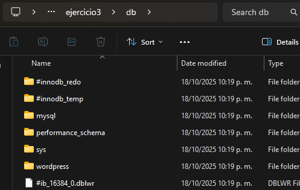
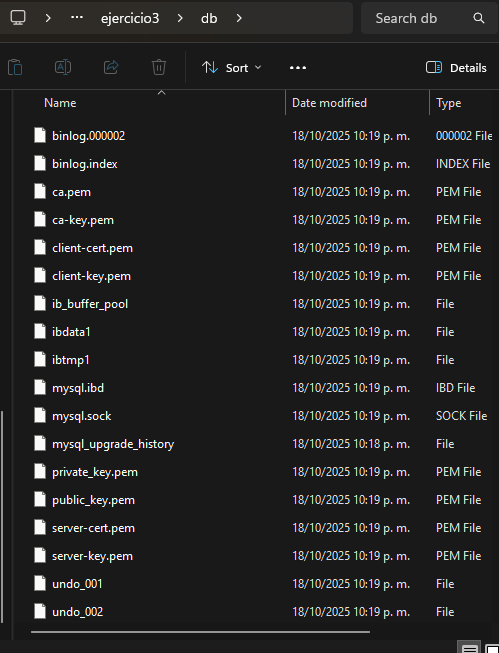

## Esquema para el ejercicio


### Crear red net-wp

```
docker network create net-wp
```

### Para que persista la información es necesario conocer en dónde mysql almacena la información.
# COMPLETAR LA SIGUIENTE ORACIÓN. REVISAR LA DOCUMENTACIÓN DE LA IMAGEN EN https://hub.docker.com/
En el esquema del ejercicio carpeta del contenedor (a) es /var/lib/mysql

Ruta carpeta host: .../ejercicio3/db

### ¿Qué contiene la carpeta db del host?
En un inicio es simplemente una carpeta vacía, al crear el contenedor MySQL contendrá todos los archivos de la base de datos (.idb, log, archivos de configuración, metadatos, etc).

### Crear un contenedor con la imagen mysql:8  en la red net-wp, configurar las variables de entorno: MYSQL_ROOT_PASSWORD, MYSQL_DATABASE, MYSQL_USER y MYSQL_PASSWORD

```
docker run -d --name mysql-wp --network net-wp -e MYSQL_ROOT_PASSWORD=rootpass -e MYSQL_DATABASE=wordpress -e MYSQL_USER=wpuser -e MYSQL_PASSWORD=wppass -v C:\ejercicio3\db:/var/lib/mysql mysql:8 
```

### ¿Qué observa en la carpeta db que se encontraba inicialmente vacía?




Se generan archivos y carpetas de manera automatica. La estructura interna de MYSQL y la base de datos “wordpress”, almacenando toda la información en el host.

### Para que persista la información es necesario conocer en dónde wordpress almacena la información.
# COMPLETAR LA SIGUIENTE ORACIÓN. REVISAR LA DOCUMENTACIÓN DE LA IMAGEN EN https://hub.docker.com/
En el esquema del ejercicio la carpeta del contenedor (b) es /var/www/html

Ruta carpeta host: .../ejercicio3/www

### Crear un contenedor con la imagen wordpress en la red net-wp, configurar las variables de entorno WORDPRESS_DB_HOST, WORDPRESS_DB_USER, WORDPRESS_DB_PASSWORD y WORDPRESS_DB_NAME (los valores de estas variables corresponden a los del contenedor creado previamente)

```
docker run -d --name wordpress --network net-wp -e WORDPRESS_DB_HOST=mysql-wp:3306 -e WORDPRESS_DB_USER=wpuser -e WORDPRESS_DB_PASSWORD=wppass -e WORDPRESS_DB_NAME=wordpress -v C:\ejercicio3\www:/var/www/html -p 8080:80  wordpress 
```

### Personalizar la apariencia de wordpress y agregar una entrada


### Eliminar el contenedor y crearlo nuevamente, ¿qué ha sucedido?
Todo se mantiene con la misma configuración, esto debido a que la base de datos como los archivos de WordPress se guardan fuera del contenedor en las carpetas.

